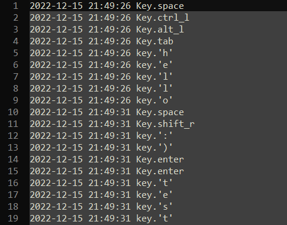

# Python Keylogger

This is a simple keylogger written in Python. It uses the pynput library to capture key presses and writes them to a log file. The log file is saved with a randomly generated name and is hidden to prevent it from being easily discovered.

## How it works
The keylogger works by creating a keyboard listener using pynput.keyboard.Listener. This listener is configured to call a function, kl_on_press, whenever a key is pressed. The kl_on_press function converts the key press to a string and adds it to a queue.

A separate loop runs continuously, checking the size of the key queue and the time since the last write to the log file. If the queue reaches a certain size or a certain time interval has passed, the loop will write the key press data from the queue to the log file. The log file is opened in append mode and the key press data is written with a timestamp.

## Usage
To use the keylogger, simply run the script. It will start logging key presses until the script is stopped. The log file will be saved in the same directory as the script with a randomly generated name.

## Limitations
This keylogger has a few limitations to be aware of. First, it only logs the keys that are pressed, not the keys that are released. This means that it will not capture key combinations such as Shift+A or Ctrl+C. Second, it only logs the keys as strings, so it will not capture special characters that are entered using the Alt or Ctrl keys. Finally, the log file is hidden, but it can still be discovered and read by someone with access to the file system.

## Output

## TODO
* add file sharing through SMTP, FTP, SFTP, HTTP, OR SSH
* improve performance
* increase stealth
* take screenshots?
* detect what program the user typed in. e.g. Google Chrome
